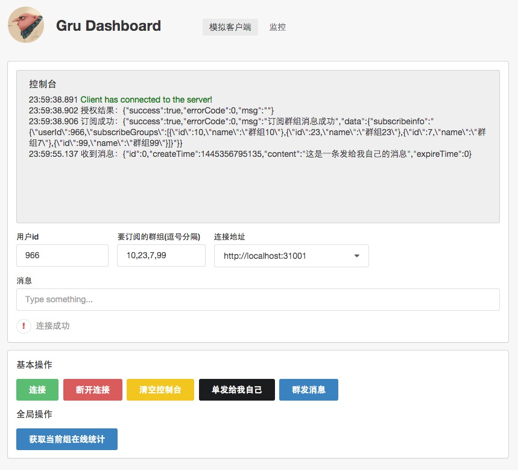
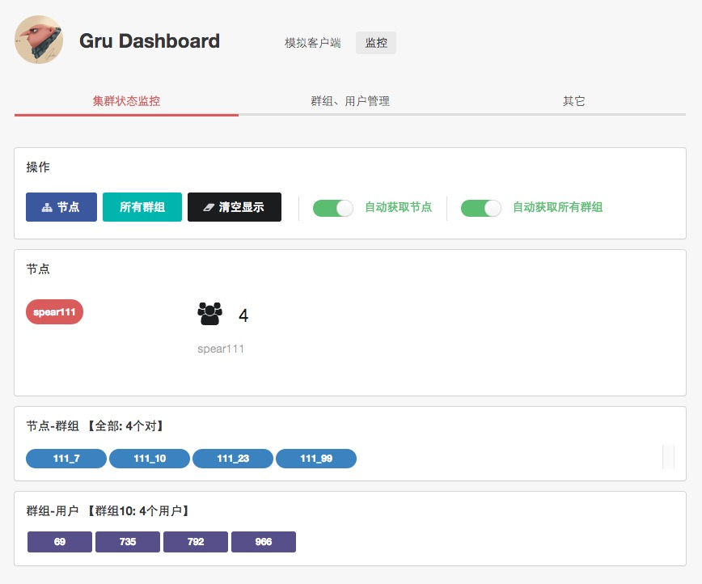

## Gru

**Gru**是一个长连接服务解决方案，可用于各种类型的实时交互应用。

##### 目前主要模块

- common 通用的一些代码、工具类等
- idgen 消息id、某些业务id生成服务
- ticket 处于最前端的发号器，客户端首先请求该服务拿到ticket才能建立长连接
- stat 统计模块、业务模块，如用户在线统计，存储逻辑等
- spear 长连接服务模块
- minions 监控模块
- spear-client 客户端模拟，压测示例代码

##### 特性

- 采用[socket.io](http://socket.io)协议
- 各模块均支持水平扩展
- 单节点可服务10W+以上长连接，具体为在不断发消息的情况下(1000条/秒)，单长连接服务节点支持的稳定连接数量在10W+(8核16G)

##### 安装部署

首先clone代码

###### 最小安装

###### 集群方式

##### 监控后台screenshots

<table>
    <tr>
        <td width="50%"></td>
        <td width="50%"></td>
    </tr>
</table>

